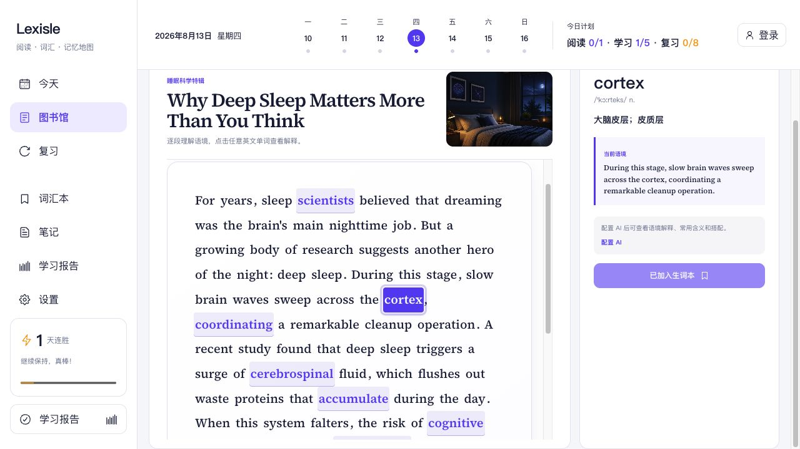
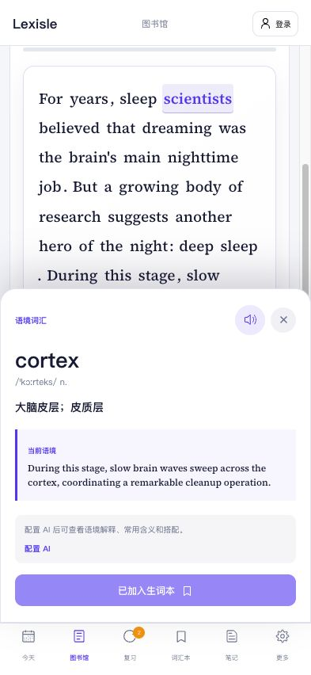

# Lexisle

Lexisle 是一个通过英文文章学习词汇的响应式 Web 应用。导入文章后，可以直接阅读，也可以按段落逐步阅读、查词、翻译并把需要记忆的单词加入词汇本。

桌面端和移动端使用同一套代码与数据，登录后通过 PocketBase 同步学习记录。

## 页面预览

### 桌面端



### 移动端



## 功能

- 通过文章链接或英文原文导入内容
- 自动识别重点词汇并在原文中高亮
- 自由阅读与逐段阅读两种模式
- 点击任意单词查看发音、释义和所在语境
- 按需翻译当前段落，手动收藏生词
- 间隔复习、每日计划、词汇本、笔记和学习报告
- 邮箱登录及跨设备同步
- 支持 OpenAI-compatible 模型；未配置或调用失败时使用本地识词
- 桌面端和移动端响应式布局

## 本地开发

需要 Node.js 20。

```bash
cd web
npm ci
npm run dev
```

默认 PocketBase 地址为 `https://pocket.nings.top`。如需连接其他实例：

```bash
VITE_POCKETBASE_URL=http://127.0.0.1:8090 npm run dev
```

## Docker

```bash
docker compose up --build -d
```

应用地址：`http://localhost:4173`

健康检查：`http://localhost:4173/healthz`

可以通过环境变量修改端口和 PocketBase 地址：

```bash
WEB_PORT=5173 \
VITE_POCKETBASE_URL=https://pocket.nings.top \
docker compose up --build -d
```

## PocketBase

数据结构定义在 [`pb_migrations/`](pb_migrations/)，包括文章、词汇、每日计划、复习记录、笔记和用户设置。

直接使用 PocketBase CLI：

```bash
./pocketbase migrate up --migrationsDir=pb_migrations
```

无法在服务器上运行 CLI 时，可以使用 Superuser Token 调用管理 API：

```bash
POCKETBASE_SUPERUSER_TOKEN="..." \
POCKETBASE_URL="https://pocket.nings.top" \
npm --prefix web run migrate:pocketbase
```

迁移脚本可以重复执行，不会删除已有数据。Superuser Token 只应放在服务端环境变量中。

## 模型配置

在“设置 → AI 单词识别”中填写接口地址、模型 ID 和 API Key。接口需兼容 OpenAI Chat Completions，并允许浏览器跨域访问。

API Key 只保存在当前浏览器，不会同步到 PocketBase。导入分析会发送文章正文；阅读记词模式只发送当前段落、少量相邻上下文和目标单词。

## 测试

```bash
cd web
npm test
npm run test:ui
npm run test:e2e
npm run build
```

CI 还会验证 Docker 镜像构建和 PocketBase 注册、同步、重新登录后的数据恢复流程。

## 项目结构

```text
.
├── pb_migrations/        PocketBase 数据迁移
├── deploy/               Nginx 配置
├── docs/screenshots/     README 页面截图
├── web/                  React Web 应用
├── compose.yaml
└── Dockerfile
```
